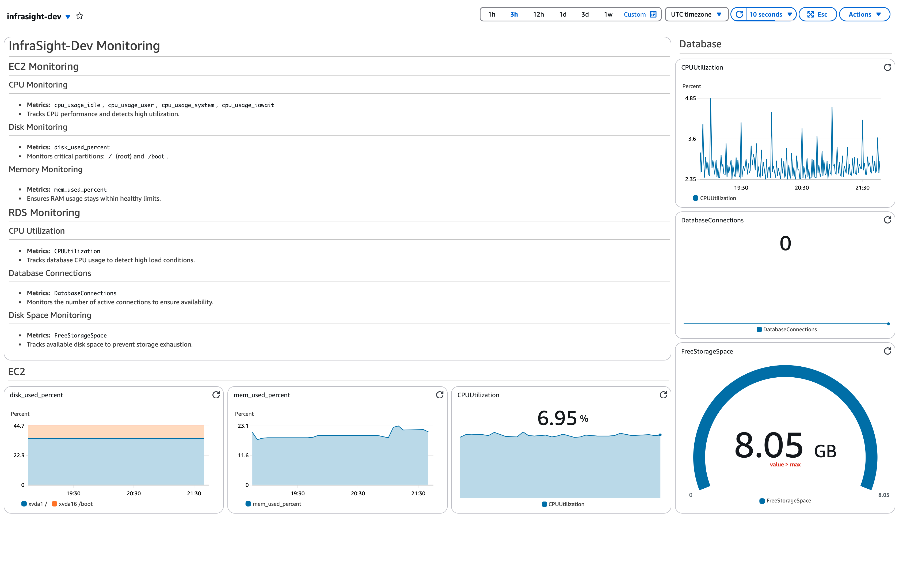
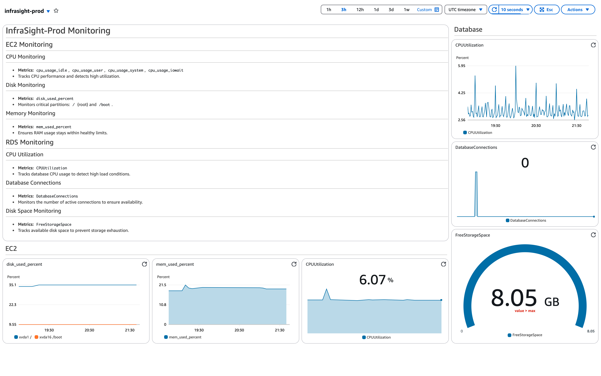

# InfraSight

- Real-time infrastructure monitoring  
- Multi-environment (Dev/Prod) support  
- Reusable Terraform modules for AWS resources  
- Modular infrastructure components (EC2, RDS, CloudWatch)  

## Project Structure

```bash
├── environments/
│   ├── dev/
│   │   ├── main.tf
│   │   ├── outputs.tf
│   │   ├── variables.tf
│   │   └── terraform.tfvars
│   ├── prod/
│   │   ├── main.tf
│   │   ├── outputs.tf
│   │   ├── variables.tf
│   │   └── terraform.tfvars
├── modules/
│   ├── ec2/
│   │   ├── main.tf
│   │   ├── outputs.tf
│   │   └── variables.tf
│   ├── rds/
│   │   ├── main.tf
│   │   ├── outputs.tf
│   │   └── variables.tf
│   ├── cloudwatch/
│   │   ├── main.tf
│   │   ├── outputs.tf
│   │   └── variables.tf
├── scripts/
│   ├── cloudwatch_agent.sh
```

## Environment Monitoring

### Dev Environment  
  

### Prod Environment  
  
